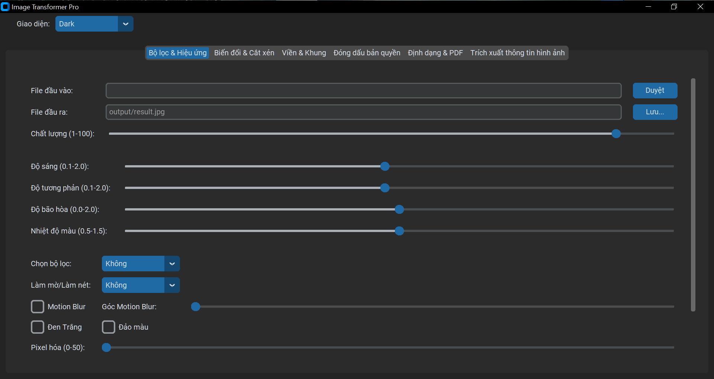
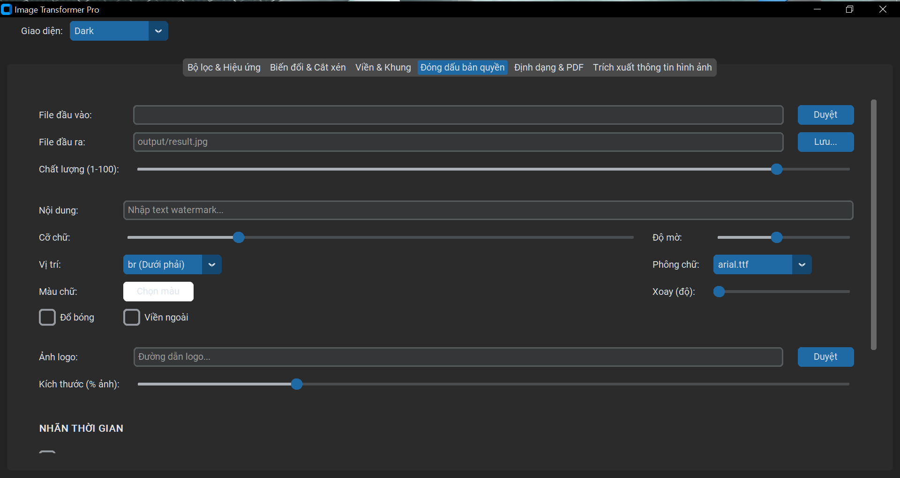
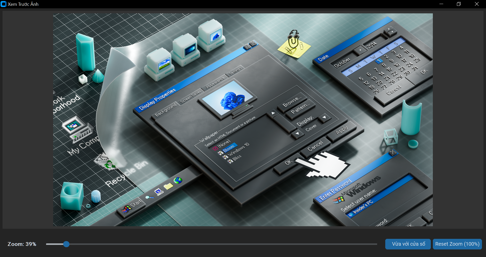

# 🎨 Image Transformer Pro


**Professional image editing software with modern GUI**

---

## 📥 Download

### Latest Release: v1.0.0

| Type | Download | Size | Description |
|------|----------|------|-------------|
| 🎁 **Installer** | [Download](https://github.com/Tachibana11111/ImageTransformerPro/releases/download/v1.0.0/ImageTransformerPro_Setup_v1.0.0.exe) | ~100MB | **Recommended** - Easy installation |
| 📦 **Portable** | [Download](https://github.com/Tachibana11111/ImageTransformerPro/releases/download/v1.0.0/ImageTransformerPro.Portable.v1.0.0.zip) | ~100MB | No installation needed |

[📋 View All Releases](https://github.com/Tachibana11111/ImageTransformerPro/releases) | [📖 User Guide](docs/user_guide.md) | [👨‍💻 Developer Guide](docs/developer_guide.md)

---

## 📸 Screenshots

### Features Overview
<details>
<summary>Click to expand screenshots</summary>

#### Filters & Effects


#### Watermark & Timestamp


#### Preview Window


</details>

---

## ✨ Features

### 🎨 Filters & Effects
- **Basic Adjustments:** Brightness, Contrast, Saturation, Temperature
- **Artistic Filters:** Sepia, Emboss, Edge Detection, Vintage, Oil Painting
- **Effects:** Blur, Sharpen, Grayscale, Invert, Pixelate, Motion Blur (with angle)

### 📐 Transform & Crop
- **Resize/Upscale** images to any dimension
- **Crop** with aspect ratios: 1:1, 16:9, 4:3, 9:16, 3:4
- **Rotate:** 90°, 180°, 270°
- **Mirror:** Horizontal, Vertical, Both

### 🖼️ Borders & Frames
- Custom **border** with color and width (0-50px)
- **Rounded corners** (0-100px radius)
- **Drop shadow** with offset, blur, and color

### 💧 Watermark & Copyright
- **Text Watermark:**
  - 17+ fonts (Arial, Times, Calibri, Georgia, Impact, etc.)
  - Bold variants available
  - Font size: 10-150
  - Opacity: 0.1-1.0
  - Position: Top/Bottom, Left/Right, Center
  - Rotation: 0-360°
  - Effects: Shadow, Outline
  
- **Image Watermark (Logo):**
  - Support PNG, JPG with transparency
  - Size: 5-50% of image width
  - Adjustable position and opacity
  
- **Timestamp:**
  - Auto-display date and time
  - Timezone support: Vietnam, Bangkok, Tokyo, UTC
  - Format: DD/MM/YYYY (TIMEZONE), HH:MM:SS

### 📄 Format Conversion
- **Supported formats:** JPG, PNG, WEBP
- **PDF to JPG** converter with DPI adjustment
- Quality control: 1-100

### 🔍 Preview & Analysis
- **Live preview** with zoom/pan
- **Fit to window** option
- **Image info extraction:** dimensions, format, color mode, file size, EXIF data

### 🎨 Modern UI
- Dark/Light theme
- Intuitive tabbed interface
- Vietnamese and English support

---

## 💻 System Requirements

### Minimum:
- **OS:** Windows 10 (64-bit) or higher
- **RAM:** 4GB
- **Storage:** 500MB free space
- **Display:** 1280x720 (HD)

### Recommended:
- **OS:** Windows 11 (64-bit)
- **RAM:** 8GB or more
- **Storage:** 1GB free space
- **Display:** 1920x1080 (Full HD)

---

## 🚀 Quick Start

### For End Users:

1. **Download** the installer or portable version
2. **Install/Extract** the application
3. **Launch** Image Transformer Pro
4. **Select** an image to edit
5. **Apply** filters and effects
6. **Preview** your changes
7. **Save** the result

📖 **Detailed guide:** [User Guide](docs/user_guide.md)

### For Developers:

```bash
# Clone repository
git clone https://github.com/Tachibana11111/ImageTransformerPro.git
cd ImageTransformerPro

# Create virtual environment
python -m venv venv
venv\Scripts\activate

# Install dependencies
pip install -r requirements.txt

# Run application
python app_gui.py
```

👨‍💻 **Development guide:** [Developer Guide](docs/developer_guide.md)

---

## 📦 Project Structure

```
ImageTransformer/
├── src/
│   ├── __init__.py
│   └── transformer.py      # Image processing functions
├── assets/
│   ├── icon.ico
│   └── screenshots/
├── docs/
│   ├── user_guide.md
│   ├── developer_guide.md
│   └── changelog.md
├── installer/
│   └── ImageTransformer.iss  # Inno Setup script
├── app_gui.py              # Main GUI application
├── requirements.txt        # Python dependencies
├── README.md
├── LICENSE
└── CHANGELOG.md
```

---

## 🛠️ Built With

- **Python 3.12** - Programming language
- **CustomTkinter** - Modern UI framework
- **Pillow (PIL)** - Image processing
- **OpenCV** - Computer vision
- **NumPy** - Numerical computing
- **PyMuPDF** - PDF processing
- **SciPy** - Scientific computing

---

## 📜 License

This project is licensed under the **MIT License** - see the [LICENSE](LICENSE) file for details.

**TL;DR:**
- ✅ Free to use for personal and commercial purposes
- ✅ Modify and distribute
- ✅ Open source
- ⚠️ No warranty
- ⚠️ Must include original copyright notice

---

## 🤝 Contributing

Contributions are welcome! Here's how you can help:

1. **Report bugs** - [Open an issue](https://github.com/Tachibana11111/ImageTransformerPro/issues)
2. **Suggest features** - [Request a feature](https://github.com/Tachibana11111/ImageTransformerPro/issues)
3. **Submit pull requests** - Fork, code, and PR
4. **Improve documentation** - Fix typos, add examples
5. **Translate** - Help translate to other languages

See [Developer Guide](docs/developer_guide.md) for more details.

---

See [CHANGELOG.md](docs/changelog.md) for version history.

---

## 📞 Support

### Need Help?

- 📧 **Email:** truyenthonga@gmail.com
- 🐛 **Bug Reports:** [GitHub Issues](https://github.com/Tachibana11111/ImageTransformerPro/issues)
- 💬 **Discussions:** [GitHub Discussions](https://github.com/Tachibana11111/ImageTransformerPro/discussions)
- 📖 **Documentation:** [User Guide](docs/user_guide.md)

---

## 🙏 Acknowledgments

Thanks to these amazing open-source projects:

- [Pillow](https://github.com/python-pillow/Pillow) - Image processing library
- [CustomTkinter](https://github.com/TomSchimansky/CustomTkinter) - Modern UI framework
- [OpenCV](https://opencv.org/) - Computer vision library
- [NumPy](https://numpy.org/) - Numerical computing
- [PyMuPDF](https://github.com/pymupdf/PyMuPDF) - PDF processing

---

## ⭐ Star History

If you find this project useful, please consider giving it a star! ⭐

[](https://star-history.com/#Tachibana11111/ImageTransformerPro&Date)

---

## 📊 Stats


---

<div align="center">

**Made with ❤️ by [Tachibana11111](https://github.com/Tachibana11111)**

© 2025 Tachibana11111. All rights reserved.

[⬆ Back to top](#-image-transformer-pro)

</div>
